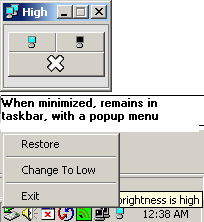



## Reduce Monitor Glare\. It's good for the eyes\. This App lets you switch between Hi/Low Monitor Brtnss

### Description

As most people(Over the age of 3-5) remember, stores used to sell tinted screens, that go over the monitor to protect vision. Well, this app does that with out using any hardware items. Also, a good demo for using taskbar to minimize a form. When minimized, it automatically appears in tasbar as an appropriate icon(monitor low has one icon, high has another) Once in taskbar, you can use it directly from there by right-clicking on it.

*NOTE, IMPORTANT: When using in IDE, please be sure to end properly, through the form - not VBEditor(Clicking stop will cause the screen to remain in its current state(Low/High) and you will have to reboot.
 
### More Info
 

             |
---                |---
**Submitted On**   |2006-09-05 02:02:08
**By**             |[Serge\_G](https://github.com/Planet-Source-Code/PSCIndex/blob/master/ByAuthor/serge-g.md)
**Level**          |Intermediate
**User Rating**    |5.0 (20 globes from 4 users)
**Compatibility**  |VB 4\.0 \(32\-bit\), VB 5\.0, VB 6\.0
**Category**       |[Complete Applications](https://github.com/Planet-Source-Code/PSCIndex/blob/master/ByCategory/complete-applications__1-27.md)
**World**          |[Visual Basic](https://github.com/Planet-Source-Code/PSCIndex/blob/master/ByWorld/visual-basic.md)
**Archive File**   |[Reduce\_Mon201798952006\.zip](https://github.com/Planet-Source-Code/serge-g-reduce-monitor-glare-it-s-good-for-the-eyes-this-app-lets-you-switch-between-hi-lo__1-66468/archive/master.zip)

